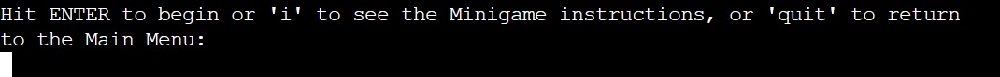
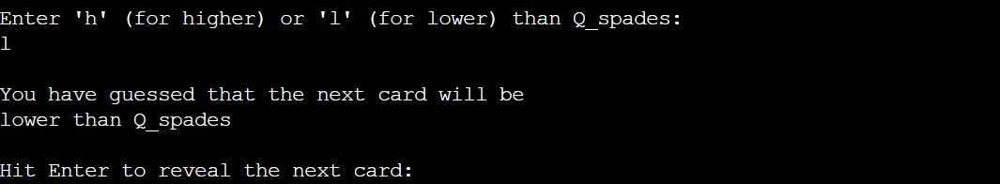
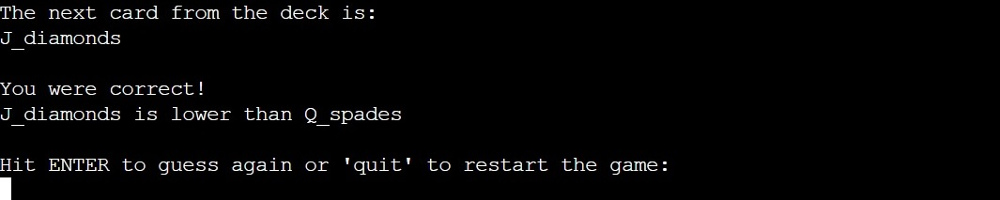

# Python Minigames [to finish]

Python Minigames are a collection of 3 mini version of games of logic, skill and chance, built in Python, including; Minesweeper, __, __ ... The option to set or reuse a username enables the user to personalise their experience and the ability to save and view scores in the leaderboard feature, allows for the games to be played casually, to track progress, or competatively, against others.

This app provides a fun and quick way to play a few small, popular games, with easy to follow instructions and user feedback allowing all kinds of user's to get started straight away. 

[Image made using <a href = "http://ami.responsivedesign.is/">Am I Responsive Website</a>]

## Contents [to finish]
---

* [Technologies Used](https://github.com/mountaincharlie/project-three-python-minigames#technologies-used)

## Technologies Used 
---

* Python

## Features
---

### Welcome Message
* Initial message and prompt to the user
    * 

### Setting Username
* Choosing a previous username
    * 
* Choosing a new username
    * 

### The Main Menu
* Personal welcome message, Main Menu display and prompt for choosing an option
    * 

### Navigation
* During the games, the user has the option to play/continue/replay the game or return to the Main Menu
    * 
    * 
    * 

### The Player Class and Subclasses

* username
     * allows for personalisation of messages
* score
    * allows for the user's score to be updated and stored in the game subclass and accessed when updating the leaderboards
* user_quit
    * allows for setting a quit attribute to exit to the Main Menu from within 2 while loops
* game_choice
    * allows for not having to re-enter the name of the game to access the instructions or leaderboard
* score_order
    * allows for the score order to be set to 'high_to_low' for games where low scores are better (default of 'low_to_high')
* The Player Class also contains functions reused for every game
* The game specific subclasses (Minesweeper example)
    * 
    * allow for dealing with the game specific user input (coordinates 'coors' for Minesweeper etc...)
    * contains a classmethod for creating the instance of the subclass from the Player Class and including the new attribute

### The Games Modules
* Included Minigames:
    * Minesweeper
    * Higher_or_Lower
    * Rock_Paper_Scissors
* Link to the Minigame instructions and features 
    * [The Minigames](https://github.com/mountaincharlie/project-three-python-minigames#the_minigames)

### The Leaderboards
* Link to the Google APIs setup and connection
    * [Google Drive and Sheets APIs](https://github.com/mountaincharlie/project-three-python-minigames#google-drive-and-sheets-apis)
* Google Sheets Spreadsheet Link
     * <a href = "https://docs.google.com/spreadsheets/d/124GeJ30MEkNUFtQfglxCuBO7tjc0yuUZdYpwh5PHQwE/edit?usp=sharing">leaderboards Google Sheet</a>
* Using Try/Excepts blocks for if the spreadsheet cannot be found:
     * At the start of the program
     
     * When trying to see previous usernames
     
     * When trying to update the leaderboard with scores
     
     * When trying to view the leaderboards
     
* Using Try/Excepts blocks for if a worksheet cannot be found:
     * When trying to see previous usernames
     
     * When trying to update the leaderboard with scores
     
     * When trying to view the leaderboards
     

### User Feedback
* Specific user feedback is provided when:
    * opening the minigames
    * setting up/building the minigame
    * opening a leaderboard to view it
    * updating a leaderboard with the user's score
    * opening the game instructions
    * informing the user of their scores
    * the user guesses correct/incorrectly or wins a round etc
    * the user makes an invalid entry (and prompts input untils its valid)
    * the leaderboards spreadsheet is required but cannot be found
    * the a leaderboard worksheet is required but cannot be found
    * the instructions txt file is required but cannot be found

### Validating User Input
* For entering a new username
    * 
* For entering a ROW/COLUMN in Minesweeper
    * 
    * 
* For choosing higher/lower in Higher_or_Lower
    * 
* For choosing rock/paper/scissors in Rock_Paper_Scissors
    * 
* For choosing from the Main Menu
    * 
* For choosing from the Leaderboards Menu
    * 

## The Minigames [to finish]
---

### Minesweeper Minigame
* How To Play:
    * 
* Walkthrough Screeenshots
    * opening the modules and the personalised welcome messages
    * 
    * building the game and the initial instructions
    * 
    * choosing coordinates and feedback
    * 
    * revealing a location (where there isnt a mine) and continue game/restart message
    * 
    * revealing a location (where there is a mine), game over screen and play again/quit to Main Menu message
    * 
    * inserting a flag 
    * 
    * removing a flag (when there isnt a flag to remove) 
    * 
    * removing a flag (when it is possible to remove a flag)
    * 
    * winning screen (flagging all the mines) and leaderboard update message 
    * 

### Higher_or_Lower Minigame
* How To Play:
    * 
* Walkthrough Screeenshots
    * opening the modules and the personalised welcome messages
    * 
    * setting up the game, the initial instructions and first card reveal
    * 
    * choosing 'higher' or 'lower', user feedback and revealing next card
    * 
    * guessing correctly and guess again/restart message 
    * 
    * when the next card is neither higher or lower
    * 
    * guessing wrong message (and the guess streak)
    * 
    * leaderboard update and play again/quit to Main Menu
    * 

### Rock_Paper_Scissors Minigame
* How To Play:
    * 
* Walkthrough Screeenshots
    * opening the modules and the personalised welcome messages
    * 
    * setting up the game, the initial instructions and choosing 'rock', 'paper' or 'scissors'
    * 
    * feedback, current scores (user or CPU wins or draw) and next round/restart message
    * 
    * finish message (you won, CPU won or you drew) leaderboard update and play again/quit message
    * 

## Google Drive and Sheets APIs
---

### APIs Used
* Google Drive
* Google Sheets
* Used in:
    * game_engine/leaderboards.py
* For:
    * Reading/updating the worksheets representing each game's leaderboard

### Setting up
* The APIs:
    * Using Code Institute's video on: <a href = "https://youtu.be/WTll5p4N7hE">Activating API credentials</a>
* The Python code/files to connect to the APIs:
    * Using Code Institute's video on: <a href = "https://youtu.be/lPTKUiafTRY">Connecting to the API with Python</a>

### Google Sheets Link
* <a href = "https://docs.google.com/spreadsheets/d/124GeJ30MEkNUFtQfglxCuBO7tjc0yuUZdYpwh5PHQwE/edit?usp=sharing">leaderboards Google Sheet</a>

## Imported Python Libraries/Modules/Packages
---

### Numpy - library
* Used in the following modules within the game_engine directory:
    * minesweeper.py
    * higher_or_lower.py
    * rock_paper_scissors.py
* Used functions:
    * .random.choice()
    * .zeros()
    * .random.randint()
    * .random.insert()
    * .random.count_nonzero()

### Sys - module
* Used in the following modules within the game_engine directory:
    * leaderboards.py
    * minesweeper.py
    * higher_or_lower.py
    * rock_paper_scissors.py
* Used in importing the Player Class from run.py which is in the directory above the game_engine directory

### Importlib - package
* Used in:
    * run.py
* Used to import a chosen module from the game_engine directory, from their full file path as a string 

## Testing [to finish]
---

To do:
### PEP8 Python Validator
* SHOULD BE: No errors or warnings
* <a href = ##LINK##>Link to validator results</a>

### Bugs and Fixes
* **Bug:** when checking if the user's input was a key in the menu_dict dictionary, the if statement was never being triggered even by input I thought was correct.
    * **Solution:** the number entered as 'input' was being assigned to its variable as a string when it needed to be an integer, so I added an 'int()' around the input.
* **Bug:** trying to find a way to update the user_quit attribute from outside the current_user instance.
    * **Solution:** adding the Property Decorator to the Player class to include Getter and Setter methods, for getting the attribute and for settings its value. [CREDIT - help from Corey Schafer's video: <a href = "https://www.youtube.com/watch?v=jCzT9XFZ5bw">Python OOP Tutorial 6: Property Decorators - Getters, Setters, and Deleters</a>]
* **Bug:** trying to find a way to set a try/except validation for my own specific cases where the user's input needed to be a certain length or a number which was a key in the menu_dict.
    * **Solution:** using an if/else statement to test the conditions and either bresk out of the while loop or raise an error which was then handled in the 'except'. [CREDIT - help from repsonse by Kevin on Stack Overflow: <a href = "https://stackoverflow.com/questions/23294658/asking-the-user-for-input-until-they-give-a-valid-response">Implementing Your Own Validation Rules</a>]
* **Bug:** trying to work out how to import the games and leaderboard modules from my seperate 'game_engine' directory, to the run.py file.
    * **Solution:** add an empty '__ init __.py' file into the directory, which tells python to treat it as a package, and to then import each module like: 'from modules import leaderboards' etc. [CREDIT - help from Chris' post on finxter: <a href = "https://blog.finxter.com/python-how-to-import-modules-from-another-folder/#:~:text=The%20most%20Pythonic%20way%20to,import%20module%20.">Method 3: Dot Notation with __ init __.py</a>]
* **Bug:** trying to call one of the game/leaderboard modules from the user choosing a dictionary key whose value was the name of the module as a string. The AttributeError kept occuring since the string of the module's name wasn't the same thing as the actual module, so didnt have any attributes, which meant when I was trying to call a function from the module this way, i kept recieving the error message. 
    * **Solution:** importing 'importlib' and then using its import_module() method to import the chosen module, with its full name as a string. For example, to call the minesweeper module: module_str = 'game_engine.minesweeper', module = importlib.import_module(module_str), module.welcome_msg() (to call the welcome_msg function from the chosen module). [CREDIT - help from NanoDano's post on Dev_DUNGEON: <a href = "https://www.devdungeon.com/content/import-python-module-string-name">Import Python Module by String Name</a>]
* **Bug:** while generating random coordinates for mines, in Minesweeper.py, there were cases where duplicate coordinates were generated, which would've meant there wouldn't be the correct number of mines in the hidden_grid.
    * **Solution:** I wrapped the random coordinate generation in a while loop which ran while the number of items in the set (coors) was less than the defined number of mines (NUM_MINES). Because it is a set, 'coors' doesn't allow duplicate values and so if a coordinate was generated in the loop that was already in the set, it would not be added to the set and so the loop would have to run an additional time inorder to generate a different unique coordinate. 
* **Bug:** when trying to import the Player class from run.py into my game modules, the code in run.py was being triggered in the import.
    * **Solution:** I wrapped all of my non-function/class code in run.py into a function called main() and called it at the end of the script. I also put the function call in an if statement that if __ name __ == __ main() __ inorder to prevent the function being called when run.py was imported. [CREDIT - help from Jeremy's answer on Stack Overflow: <a href = "https://stackoverflow.com/questions/6523791/why-is-python-running-my-module-when-i-import-it-and-how-do-i-stop-it/6523855#6523855">prevent code in the module from being executed when imported</a>]
* **Bug:** popping the final value from leaderboards_menu dictionary inside the leaderboards module's main() function meant that everytime game_engine.leaderboards.main(current_user) was called from run.py, another value was removed from leaderboards_menu dictionary.
    * **Solution:** defining leaderboards_menu outside of its main() function so that the last value is removed from its call of run.menu_dict instead of previous stored version of leaderboards_menu.
* **Bug:**
    * **Solution:**

### Unfixed Bugs
* SHOULD BE: No unfixed bugs

## Deployment
---

### Deploying To Heroku
* Using 'pips freeze > requirements.txt' to create a list of dependencies for the project, to ensure that Heroku installs these when building the project.
* Creating a <a href = "https://signup.heroku.com/login">Heroku account</a>
* Adding 2 sets of Config Vars in Heroku's Settings Tab (for data important to the project but not pushed to the GitHub repo):
    * KEY = CREDS, VALUE = 'contents of creds.json file'
    * KEY = PORT, VALUE = 8000
* Adding 2 Buildpacks in Heroku's Settings Tab:
    * heroku/python
    * heroku/nodejs
* Choosing Deployment Method in Heroku's Deploy Tab: 
    * selecting GitHub
    * searching for the correct repo name and choosing to connect it
    * enabling Automatic Deploys (everytime changes are pushed to GitHub)

### Live Links
* <a href = "https://python-minigames.herokuapp.com/">Python Minigames App</a>
* <a href = "https://docs.google.com/spreadsheets/d/124GeJ30MEkNUFtQfglxCuBO7tjc0yuUZdYpwh5PHQwE/edit?usp=sharing">leaderboards Google Sheet</a>

## Credits
---

### Code Institute
* API setup videos:
    * <a href = "https://youtu.be/WTll5p4N7hE">Activating API credentials</a>
    * <a href = "https://youtu.be/lPTKUiafTRY">Connecting to the API with Python</a>
* Deployment to Heroku videos:
    * <a href = "https://youtu.be/BhW26FryaYI">Deploying Our Project Part 1</a>
    * <a href = "https://youtu.be/ONx3iEqAOM4">Deploying Our Project Part 2</a> 
* GitHub Template: 
    * <a href = "https://github.com/Code-Institute-Org/python-essentials-template">Python Essentials Template</a> 

### Help With Bug Fixes
* Corey Schafer's video: <a href = "https://www.youtube.com/watch?v=jCzT9XFZ5bw">Python OOP Tutorial 6: Property Decorators - Getters, Setters, and Deleters</a> for creating a getter and setter in my Player Class.
* Repsonse by Kevin on Stack Overflow: <a href = "https://stackoverflow.com/questions/23294658/asking-the-user-for-input-until-they-give-a-valid-response">Implementing Your Own Validation Rules</a> for using if/else statements to trigger my own validation rules.
* Chris' post on finxter: <a href = "https://blog.finxter.com/python-how-to-import-modules-from-another-folder/#:~:text=The%20most%20Pythonic%20way%20to,import%20module%20.">Method 3: Dot Notation with __ init __.py</a> for how to import modules from a sperate directory.
* NanoDano's post on Dev_DUNGEON: <a href = "https://www.devdungeon.com/content/import-python-module-string-name">Import Python Module by String Name</a> for how to import a module using its name as a string.
* Jeremy's answer on Stack Overflow: <a href = "https://stackoverflow.com/questions/6523791/why-is-python-running-my-module-when-i-import-it-and-how-do-i-stop-it/6523855#6523855">prevent code in the module from being executed when imported</a> for how to prevent a module's code being exectuted when its imported into another module.
* Kite's post: <a href = "https://www.kite.com/python/answers/how-to-iterate-through-a-decreasing-range-with-a-for-loop-in-python">How to iterate through a decreasing range with a for-loop in Python</a> for how to iterate through a decreasing range with a for-loop.

### Code Snippets Borrowed From/Inspired By
* GeeksforGeeks's post: <a href = "https://www.geeksforgeeks.org/python-remove-square-brackets-from-list/">Python | Remove square brackets from list</a> for how to remove the square brackets from a list, using the str() method and list slicing, which i used in minesweeer.py for displaying the display_grid to the user.
* Part of MSeifert's answer on Stack Overflow: <a href = "https://stackoverflow.com/questions/36964875/sum-of-8-neighbors-in-2d-array/37026344#37026344">calculate the sum of a particular region</a> for how to create 2 array of the region (8 surrounding coordinates) around a coordinate, including the corrdinate, which I used in minesweeper.py to find the number of mines surrounding a coordinate.
* Help from peterz's answer on Stack Overflow: <a href = "https://stackoverflow.com/questions/63117963/how-to-instantiate-a-subclass-type-variable-from-an-existing-superclass-type-obj/63173689#63173689">instantiate a subclass type variable from an existing superclass type object in Python</a> for how to create an instance of a SubClass which used the attribute values from an instance of a SuperClass, which I used inorder to create an instance of the SubClass in each game module, from the Player SuperClass in run.py, using the attribute values from the current_user instance of Player in run.py. 
* Using Sepero's answer on Stack Overflow: <a href = "https://stackoverflow.com/questions/1054271/how-to-import-a-python-class-that-is-in-a-directory-above/11096846#11096846">How to import a Python class that is in a directory above?</a> for how to import a class from a directory above the one it was being imported into, which I used to import my Player Class from run.py into my game modules.

## Program Expansion Ideas
---

Features that could be added to expand and improve the program in the future.

### Change Username
* Main Menu option to change to a different user or enter a new username

### Easy/Medium/Hard modes
* 3 difficulty levels for each game, with the user asked to choose at the start of the game
* For the leaderboard scores there could either be a score mulitplier for those that play on a harder difficulty or could be a seperate worksheet for each mode

### Hangman Game
* Using the PyDictionary library to generate a random word
* Creating the Hangman 'image' with just keyboard characters
* The length of the random word is used to make a string of '_' of the same length which is displayed to the user
* A list of the full alphabet is displayed to the user and they're prompted to enter a chosen letter
* The input is validated and the user is prompted for input until it is valid
* A check is made if the letter is is in the word and how many times 
* If the letter is in the word it replaces the '_'s in the correct places and is displayed to the user for the next guess 
* If the letter isnt in the word, then next bit of the hangman 'image' is added and displayed with the prompt for the next guess
* The chosen letter is removed from the full alphabet list and added to the 'chosen letters' list which is also diplayed to the user 
* The user either 'runs out of lives', guesses the whole word or choses to quit at some point
* The user's score is the number of guesses they made (the lower the better)
* (additionally, the definition of the word could be displayed in the game finish message)
